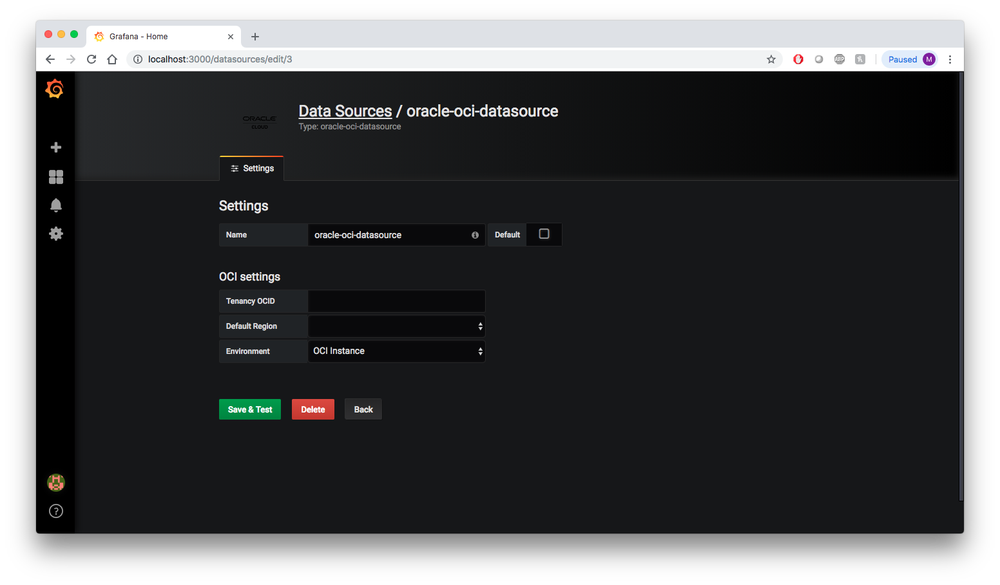

# Oracle Kubernetes Engine Installation - Oracle Cloud Infrastructure Data Source for Grafana

## Pre-requisites:

* [Oracle Container Engine for Kubernetes (OKE)](http://www.oracle.com/webfolder/technetwork/tutorials/obe/oci/oke-full/index.html)
* [Kubectl 1.7.4](https://kubernetes.io/docs/tasks/tools/install-kubectl/)
* [Helm](https://github.com/kubernetes/helm#install) 

## Background

Grafana is a popular technology that makes it easy to visualize metrics. The [Oracle Cloud Infrastructure Data Source for Grafana](https://grafana.com/plugins/oci-datasource) is used to extend Grafana by adding OCI as a data source. The plugin enables you to visualize metrics related to a number of OCI resources: Compute, Networking, Storage, and custom metrics.

This walkthrough is intended for use by people who would like to deploy Grafana and the OCI Data Source for Grafana on a Kubernetes environment.

Make sure you have access to the [Monitoring Service](https://docs.cloud.oracle.com/iaas/Content/Monitoring/Concepts/monitoringoverview.htm) and that [metrics have been enabled](https://docs.cloud.oracle.com/iaas/Content/Compute/Tasks/enablingmonitoring.htm) for the resources you are trying to monitor.

## Configuring the OCI Identity policies

In order to use the the OCI Data Source for Grafana on OKE, the first step is to create a [dynamic group](https://docs.cloud.oracle.com/iaas/Content/Identity/Tasks/managingdynamicgroups.htm) used to group virtual machine or bare metal compute instances as “principals” (similar to user groups). Create a dynamic group that corresponds to all of your OKE worker nodes:

   

Next, create a [policy](https://docs.cloud.oracle.com/iaas/Content/Identity/Concepts/policygetstarted.htm) named “grafana_policy” in the root compartment of your tenancy to permit instances in the dynamic group to make API calls against Oracle Cloud Infrastructure services. Add the following policy statements:

* `allow dynamicgroup grafana to read metrics in tenancy`
* `allow dynamicgroup grafana to read compartments in tenancy`

   

## The Grafana Helm chart

Next, we are going to install the stable Helm chart for Grafana. We will do this in two parts: First, update the stable repository by running: `helm repo update`

Next, install the chart for Grafana. 
 For OSS Grafana run: `helm install --set plugins=oci-metrics-datasource grafana bitnami/grafana`

## Accessing Grafana

To see if everything is working correctly, access Grafana using Kubernetes port-forwarding. To do this run: `export POD_NAME=$(kubectl get pods --namespace default -l "app=grafana,release=grafana" -o jsonpath="{.items[0].metadata.name}")`

Followed by: `kubectl --namespace default port-forward $POD_NAME 3000`

You can obtain the password for the admin user by running: `kubectl get secret --namespace default grafana -o jsonpath="{.data.admin-password}" | base64 --decode ; echo`

## Configure Grafana

The next step is to configure the plugin. Navigate to the Grafana homepage at `http://localhost:3000`

Log in with the default username `admin` and the password you obtained from the kubectl command from the previous section.

On the Home Dashboard click the gear icon on the left side of the page.

Click **Add data source**.

 Choose **oracle-oci-datasource** as your data source type.

Fill in your **Tenancy OCID**, **Default Region**, and **Environment**. Your **Default region** is the same as your home region listed in the **Tenancy Details** page. For **Environment** choose **OCI Instance**. 

Click **Save & Test** to return to the home dashboard.

## Next Steps

Check out how to use the newly installed and configured plugin in our [Using Grafana with Oracle Cloud Infrastructure Data Source](using.md) walkthrough. 

