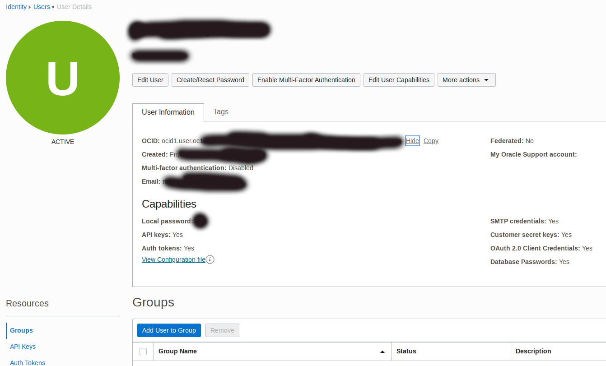

# Local Installation (Linux) - Oracle Cloud Infrastructure Data Source for Grafana

## Background

Grafana is a popular technology that makes it easy to visualize metrics. The Oracle Cloud Infrastructure Data Source for Grafana is used to extend Grafana by adding OCI as a data source. The plugin enables you to visualize metrics related to a number of OCI resources: Compute, Networking, Storage, and custom metrics.

This walkthrough is intended for use by people who would like to deploy Grafana and the OCI Data Source for Grafana on a local server.

Make sure you have access to the [Monitoring Service](https://docs.cloud.oracle.com/iaas/Content/Monitoring/Concepts/monitoringoverview.htm) and that [metrics have been enabled](https://docs.cloud.oracle.com/iaas/Content/Compute/Tasks/enablingmonitoring.htm) for the resources you are trying to monitor.

## Getting OCI Configuration values

To configure OCI Metrics Grafana Data Source, you'll need to get the necessary provider and resource settings. Please note that Migrating from version 3.x.x to version 4.x.x and above will require to migrate the existing data source configuration: using version 4.x.x and above of the plugin with the data source configuration of version 3.x.x is **not possible**. In case you are migrating from previous version 3.x.x of the OCI Metrics Grafana Plugin, you can refer to the [**Migration Instructions for Grafana OCI Metrics Data Source Settings (User Principals and Single Tenancy mode only)**](migration.md). If you are configuring the plugin to work in Multitenancy Mode, you will need to repeat the following steps for each of the Tenancies you want to configure with the plugin (up to 5 additional Tenancies are supported).

### Getting the Region

To get the region for your OCI cloud, follow these steps:

1. Log in to the OCI console.
2. From the OCI menu, select the **Region** dropdown in the top right corner of the page.
3. The region is listed next to **Home**.

For details and reference, see: [Regions and Availability Domains](https://docs.oracle.com/en-us/iaas/Content/General/Concepts/regions.htm#top)
Make note of the region as you'll need it later to configure your OCI Metrics Grafana Data Source.

### Getting the Tenancy OCID

To get the tenancy OCID, follow these steps:

1. Log in to the OCI console.
2. From the OCI menu, click on your profile icon on the top right:


3. Click on Tenancy
4. The tenancy OCID is listed in the **Tenancy Information** section.


For details and reference, see: [Where to Get the Tenancy's OCID and User's OCID](https://docs.oracle.com/en-us/iaas/Content/API/Concepts/apisigningkey.htm#five)
Make note of the tenancy OCID as you'll need it later to configure your OCI Metrics Grafana Data Source.

### Getting the User OCID

To get the user OCID, follow these steps:

1. Log in to the OCI console.
2. From the OCI menu, select **Identity** > **Users**.
3. Click on the user you want to use with OCI Metrics Grafana Data Source.
4. The user OCID is listed in the **User Details** section.



For details and reference, see: [Where to Get the Tenancy's OCID and User's OCID](https://docs.oracle.com/en-us/iaas/Content/API/Concepts/apisigningkey.htm#five).
Make note of the user OCID as you'll need it later to configure your OCI Metrics Grafana Data Source.

### Getting the Private API Key and Fingerprint

To get the private key, follow these steps:

1. Log in to your **OCI tenancy** and click on your username on the top right corner.
2. Go to **Resources** and **API Keys** and click on **Add API Key**.
3. Choose if you want to generate a new API key or use your own:
    - Select **Generate API Key Pair** if you want to generate a new API key. Click then on **Download Private Key** and **Download Public Key** to get your new generated key
    - Select **Public Key File** or **Paste Public Key** in case you want to paste your own public key: select **Paste Public Key** in the **Add API Key** dialog and copy and paste the key contents into the field, then click **Add**.


4. Once the key is added take note of the API key fingerprint listed in the **Fingerprint** column.


For details on how to create and configure keys see [How to Generate an API Signing Key](https://docs.oracle.com/en-us/iaas/Content/API/Concepts/apisigningkey.htm#two) and [How to Upload the Public Key](https://docs.oracle.com/en-us/iaas/Content/API/Concepts/apisigningkey.htm#three).
Make note of the private key file location and API key fingerprint as you'll need it later to configure your OCI Metrics Grafana Data Source.
## Configure OCI Identity Policies

In the OCI console under **Identity > Groups** click **Create Group** and create a new group called **grafana**. Add the user configured in the OCI CLI to the newly-created group.


Under the **Policy** tab click **Create Policy** and create a policy allowing the group to read tenancy metrics. Add the following policy statements:

- `allow group grafana to read metrics in tenancy`
- `allow group grafana to read compartments in tenancy`


## Install Grafana and the OCI Metrics Plugin for Grafana 8 and above

To [install OCI Metrics Plugin](https://grafana.com/grafana/plugins/oci-metrics-datasource/) make sure you are running [Grafana 8**](https://grafana.com/get) or above. The latest version of the plugin 5.x.x is available on Grafana Catalogue. Go to Administration on main Grafana menu, and choose plugin. Then you can search for oracle and you will find the plugin:

  

Click on the metrics plugin to install. The plugin will be installed into your Grafana plugins directory, which by default is located at /var/lib/grafana/plugins. [Here is more information on the CLI tool](http://docs.grafana.org/plugins/installation/).

### Manual installation for previous Grafana Server versions(<8)

Alternatively, you can manually download the .tar file and unpack it into your /grafana/plugins directory. To do so, change to the Grafana plugins directory: `cd /usr/local/var/lib/grafana/plugins`. Download the OCI Grafana Plugin: wget `https://github.com/oracle/oci-grafana-plugin/releases/download/<v.version#>/plugin.tar`. Create a directory and install the plugin: `mkdir oci && tar -C oci -xvf plugin.tar` and then remove the tarball: `rm plugin.tar`.

> **Additional step for Grafana 7**. Make sure the plugin version is <= 2.2.4. Open the grafana configuration  *grafana.ini* file and add the `allow_loading_unsigned_plugins = "oci-datasource"` in the *plugins* section.

*Example*

```
    [plugins]
    ;enable_alpha = false
    ;app_tls_skip_verify_insecure = false
    allow_loading_unsigned_plugins = "oci-datasource"
```

To start the Grafana server, run: `sudo systemctl start grafana-server`.

Navigate to the Grafana homepage at http://localhost:3000.

## Configure Grafana

You can use a manual configuration or a programatic configuration.
In case you want to use the datasource.yaml based plugin configuration you can refers to this document: [Data source configuration using yaml file](https://github.com/oracle/oci-grafana-plugin/blob/master/docs/datasource_configuration.md)

For Manual installation use the following steps:


Log in with the default username `admin` and the password `admin`. You will be prompted to change your password. Click **Skip** or **Save** to continue.


On the Home Dashboard click the gear icon on the left side of the page.


Click **Add data source**.


Choose **oracle-oci-datasource** as your data source type.


This Configuration screen will appear:


For **Authentication Provider** choose **OCI User** and then choose between **single** or **multitenancy** as **Tenancy mode**.
You can then choose between two different modes as **Tenancy mode**:

* **single**: to use a single specific Tenancy
* **multitenancy**: to use multiple tenancies

### Configure Plugin in Single Tenancy Mode
If you selected **single** as **Tenancy mode** then fill in the following credentials:

* `Profile Name` - A user-defined name for this profile. In **single** mode this is automatically set to **DEFAULT** and cannot be modified.
* `Dedicated Region` (optional) - Toggle this to configure dedicated Region and domain such as in DRCC/Alloy Regions (not needed for commercial or sovereign regions)
* `Region` - An OCI region. To get the value, see [**Getting Region Configuration value**](#getting-the-region).
* `User OCID` - OCID of the user calling the API. To get the value, see [**Getting User OCID Configuration value**](#getting-the-user-OCID).
* `Tenancy OCID` - OCID of your tenancy. To get the value, see [**Getting Tenancy OCID Configuration value**](#getting-the-tenancy-OCID).
* `Fingerprint` - Fingerprint for the key pair being used. To get the value, see [**Getting Fingerprint Configuration value**](#getting-the-private-api-key-and-fingerprint).
* `Private Key` - The contents of the private key file. To get the value, see [**Getting Private Key Configuration value**](#getting-the-private-api-key-and-fingerprint).

The configured data source will look like the following:


In case you are setting up a Dedicated Region, you must provide these two additional information:
* `Region` - The DRCC/Alloy region. To get the value, see [**Getting Region Configuration value**](#getting-the-region).
* `Domain` - The first level domain of your Dedicated Region.

The configured data source with dedicated Region and domain configuration will look like the following:


Click **Save & Test** to return to the home dashboard.


### Configure Plugin in Multi-Tenancy Mode
If you selected **multi** as **Tenancy mode** then fill in the following credentials for **each Tenancy you want to configure (up to 5 additional tenancies)**:

* `Profile Name` - A user-defined name for this profile. The first Tenancy is automatically set to **DEFAULT** and cannot be modified. You need to specify a custom and unique Profile name for each of the additional tenancies.
* `Dedicated Region` (optional) - Toggle this to configure dedicated Region and domain such as in DRCC/Alloy Regions (not needed for commercial or sovereign regions)
* `Region` - An OCI region. To get the value, see [**Getting Region Configuration value**](#getting-the-region).
* `User OCID` - OCID of the user calling the API. To get the value, see [**Getting User OCID Configuration value**](#getting-the-user-OCID).
* `Tenancy OCID` - OCID of your tenancy. To get the value, see [**Getting Tenancy OCID Configuration value**](#getting-the-tenancy-OCID).
* `Fingerprint` - Fingerprint for the key pair being used. To get the value, see [**Getting Fingerprint Configuration value**](#getting-the-private-api-key-and-fingerprint).
* `Private Key` - The contents of the private key file. To get the value, see [**Getting Private Key Configuration value**](#getting-the-private-api-key-and-fingerprint).

By default, if you selected **multi** as **Tenancy mode** you can configure one DEFAULT tenancy with an additional one. You may add others tenancy **(up to 5 additional tenancies)** using the **Add another Tenancy** checkbox.

The configured data source will look like the following:


In case you are setting up a Dedicated Region, you must provide these two additional information:
* `Region` - The DRCC/Alloy region. To get the value, see [**Getting Region Configuration value**](#getting-the-region).
* `Domain` - The first level domain of your Dedicated Region.

The configured data source with dedicated Region and domain configuration will look like the following:


Click **Save & Test** to return to the home dashboard.

After the initial configuration, you can modify the datasource by adding a new tenancy by clicking on the **Add another Tenancy** checkbox and filling in the additional credentials. You can also disable a configured Tenancy leaving ampty the **Profile Name** as in this screenshot:


## Next Steps

Check out how to use the newly installed and configured plugin in our [Using Grafana with Oracle Cloud Infrastructure Data Source](using.md) walkthrough.
