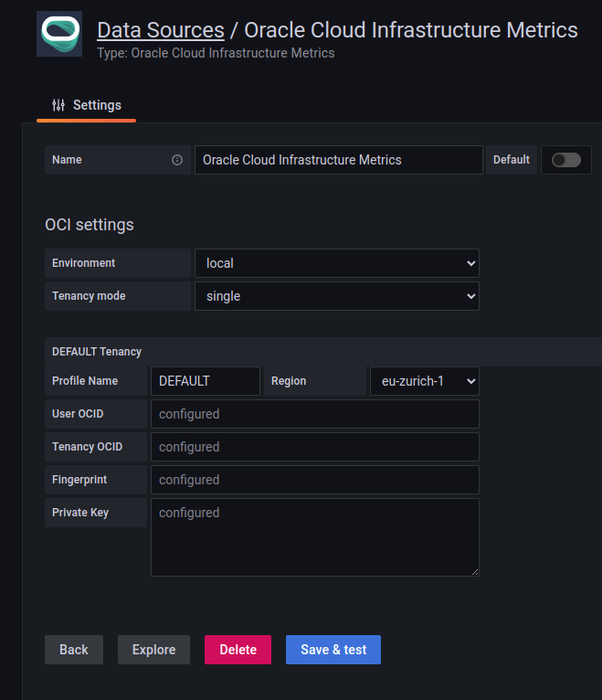

## Migration Instructions for Grafana OCI Metrics Data Source Settings (User Principals and Single Tenancy mode only)

DO NOT USE this migration guide if your OCI Metrics Data Source is configured to use the `Instance Principals` authentication method. This guide is intended for users who are using the `User Principal` authentication method! In case your Data Source is using the `Instance Principals` authentication method there is no need to migrate. 

This document describes the steps to migrate data from the `.oci/config` file to the Grafana data source settings for the following variables:

* `user`
* `fingerprint`
* `tenancy`
* `region`

Additionally, we will copy the ID key stored in a file (whose path is stored in the `key_file` variable) into the Grafana data source settings.

### Prerequisites

Before starting the migration process, please make sure you have the following:

* Access to the Grafana instance where the data source settings will be updated.
* The `.oci/config` file containing the variables to be migrated (`user`,`fingerprint`,`tenancy`,`region`) and the ID key (`key_file`).

### Steps

1. Log in to your Grafana instance and go to the data source settings page.
2. Locate the OCI Metrics data source where you want to update the settings and click on the "Edit" button. Configuration parameters will look like the following:

3. Choose `local` as `Environment` and `single` as `Tenancy Mode`
4. Fill in the following:
   * `Profile Name` - A user-defined name for this profile. In **single** mode this is automatically set to **DEFAULT** and cannot be modified.
   * `Region` - An OCI region. Update it with the content of variables `region` from the `.oci/config` file.
   * `User OCID` - OCID of the user calling the API. Update it with the content of variables `user` from the `.oci/config` file.
   * `Tenancy OCID` - OCID of your tenancy. Update it with the content of variables `tenancy` from the `.oci/config` from the `.oci/config` file.
   * `Fingerprint` - Fingerprint for the key pair being used. Update it with the content of variables `fingerprint` from the `.oci/config` file.
   * `Private Key` - The contents of the private key file. Update it with the content of the file stored at the path specified in the `key_file` variable in `.oci/config` file.
5. Save the changes to the data source settings. Configuration parameters will look then like the following:

### Conclusion

By following these steps, you should have successfully migrated the data from the `.oci/config` file to the Grafana OCI Metrics data source settings (User Principals and Single Tenancy mode only) for the specified variables and the ID key. Please note that the process cannot be reverted, and rollback to previous configuration with the config file is not possible. Also, once migrated to version 4.x.x and above of the plugin, moving back to version 3.x.x is not possible.
