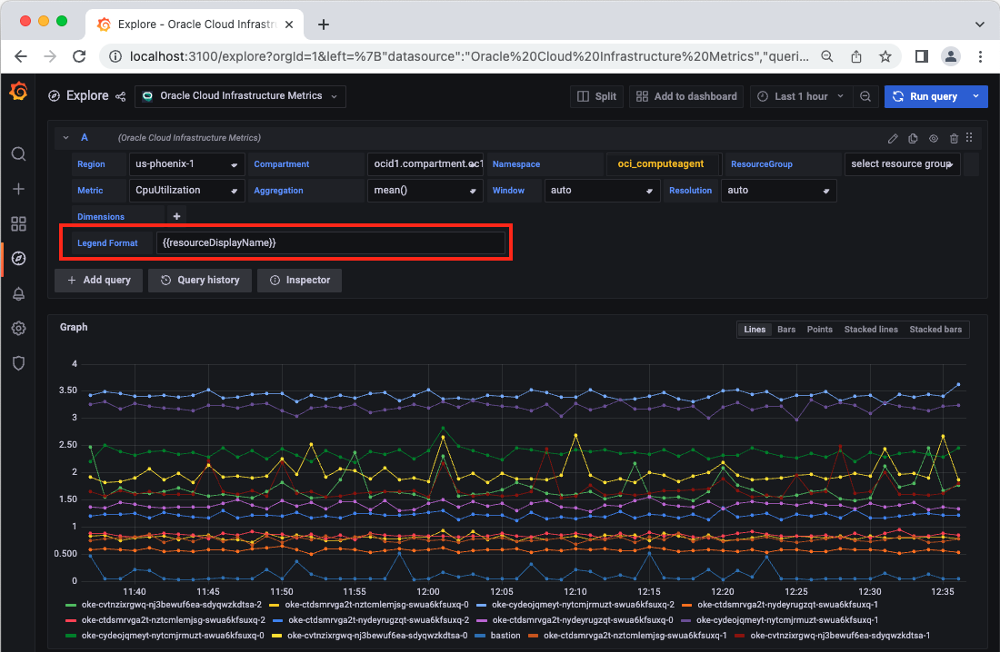

# Local Installation (Linux) with multitenancy support - Oracle Cloud Infrastructure Data Source for Grafana


## Background

Grafana is a popular technology that makes it easy to visualize metrics. The Oracle Cloud Infrastructure Data Source for Grafana is used to extend Grafana by adding OCI as a data source. The plugin enables you to visualize metrics related to a number of OCI resources: Compute, Networking, Storage, and custom metrics.

This walkthrough is intended for use by people who would like to deploy Grafana and the OCI Data Source for Grafana on a local server.

Make sure you have access to the [Monitoring Service](https://docs.cloud.oracle.com/iaas/Content/Monitoring/Concepts/monitoringoverview.htm) and that [metrics have been enabled](https://docs.cloud.oracle.com/iaas/Content/Compute/Tasks/enablingmonitoring.htm) for the resources you are trying to monitor.

## Multitenancy support

This version of the OCI plugin includes the multitenancy support. That means that the plugin is able to query different tenancies as they are configured in the .oci/config file. Instance pcrincipals is not yet supported to operate in multitenancy mode.
For existing grafana dashboards created with the legacy single tenancy plugin datasource configuration, retrocompatibility is supported under the following schema:


|                                                   | Dashboard created with plugin configured with .oci/config file | Dashboard created with plugin configured with instance principals |
| --------------------------------------------------- | ---------------------------------------------------------------- | ------------------------------------------------------------------- |
| New Plugin release with existing Datasource configuration | Dashboard should load with no action required                  | Dashboard should load with no action requiredNo action required   |
| New Plugin release with single tenancy Datasource | Dashboard should load with no action required                  | Dashboard should load with no action requiredNo action required   |
| New Plugin release with multitenancy Datasource   | Dashboard should be modified selecting the tenancy             | Dashboard should be modified selecting the tenancy                |


In general Dashboard does not require to be modified if the dashboard will continue to use the datasource with which it was created and in case it will use a datasource configured in single tenancy mode. If the legacy dashboard will be imported into a multitenancy configured datasource, then the dashboard needs to be modified, including the tenancy to be used, and then saved, as in the following example:


## Install the Oracle Cloud Infrastructure CLI

The [Oracle Cloud Infrastructure CLI](https://docs.cloud.oracle.com/iaas/Content/API/Concepts/cliconcepts.htm) provides you with a way to perform tasks in OCI from your command line rather than the OCI Console. It does so by making REST calls to the [OCI APIs](https://docs.cloud.oracle.com/iaas/Content/API/Concepts/usingapi.htm). We will be using the CLI to authenticate between our local environment hosting Grafana and OCI in order to pull in metrics. The CLI is built on Python (version 2.7.5 or 3.5 or later), running on Mac, Windows, or Linux.

Begin by [installing the Oracle Cloud Infrastructure CLI](https://docs.cloud.oracle.com/iaas/Content/API/SDKDocs/cliinstall.htm). Follow the installation prompts to install the CLI on your local environment. After the installation is complete, use the `oci setup config` command to have the CLI walk you through the first-time setup process. If you haven't already uploaded your public API signing key through the console, follow the instructions [here](https://docs.us-phoenix-1.oraclecloud.com/Content/API/Concepts/apisigningkey.htm#How2) to do so.

After the CLI has been configured, move the `~/.oci` folder to `/usr/share/grafana` and then change ownership of the `/usr/share/grafana/.oci folder` to the “grafana” user: `sudo chown -R grafana:grafana /usr/share/grafana/.oci`. Update the `key_file` location in `/usr/share/grafana/.oci/config` to the current folder `/usr/share/grafana/.oci/your_key.pem`.

## Configure OCI Identity Policies

In the OCI console under **Identity > Groups** click **Create Group** and create a new group called **grafana**. Add the user configured in the OCI CLI to the newly-created group.


Under the **Policy** tab click **Create Policy** and create a policy allowing the group to read tenancy metrics. Add the following policy statements:

- `allow group grafana to read metrics in tenancy`
- `allow group grafana to read compartments in tenancy`


## Install Grafana and the OCI Metrics Plugin for Grafana

To [install OCI Metrics Plugin](https://grafana.com/grafana/plugins/oci-metrics-datasource/) make sure you are running [Grafana 8**](https://grafana.com/get). Use the [grafana-cli tool](http://docs.grafana.org/plugins/installation/) to install the Oracle Cloud Infrastructure Data Source for Grafana from the command line:

```
grafana-cli plugins install oci-metrics-datasource
```

**NOTE** Today the latest version of the plugin 3.x.x is available only with Grafana CLI. We will release it's binary on [its Github repo](https://github.com/oracle/oci-grafana-plugin) very soon.

The plugin will be installed into your Grafana plugins directory, which by default is located at /var/lib/grafana/plugins. [Here is more information on the CLI tool](http://docs.grafana.org/plugins/installation/).

### Manual installation for previous Grafana Server versions(<8)

Alternatively, you can manually download the .tar file and unpack it into your /grafana/plugins directory. To do so, change to the Grafana plugins directory: `cd /usr/local/var/lib/grafana/plugins`. Download the OCI Grafana Plugin: wget `https://github.com/oracle/oci-grafana-plugin/releases/download/<v.version#>/plugin.tar`. Create a directory and install the plugin: `mkdir oci && tar -C oci -xvf plugin.tar` and then remove the tarball: `rm plugin.tar`.

> **Additional step for Grafana 7**. Make sure plugin version is <= 2.2.4 . Open the grafana configuration  *grafana.ini* file and add the `allow_loading_unsigned_plugins = "oci-datasource"` in the *plugins* section.

*Example*

```
    [plugins]
    ;enable_alpha = false
    ;app_tls_skip_verify_insecure = false
    allow_loading_unsigned_plugins = "oci-datasource"
```

To start the Grafana server, run: `sudo systemctl start grafana-server`.

Navigate to the Grafana homepage at http://localhost:3000.

## Configure Grafana


Log in with the default username `admin` and the password `admin`. You will be prompted to change your password. Click **Skip** or **Save** to continue.


On the Home Dashboard click the gear icon on the left side of the page.


Click **Add data source**.


Choose **oracle-oci-datasource** as your data source type.


For **Environment** choose **local** and then choose **multitenancy** as **Tenancy mode**.

Once you selected **multitenancy** as **Tenancy mode** then fill in your **Default Region**.


Click **Save & Test** to return to the home dashboard. Each entries in the .oci/config file will then tested. You can find the results of each entry test in the Grafana logs.

# Using Grafana with the Oracle Cloud Infrastructure Data Source

Here are a few tools for you to explore after installing and configuring the Oracle Cloud Infrastructure Data Source for Grafana. Refer to [this page](https://docs.cloud.oracle.com/iaas/Content/Monitoring/Concepts/monitoringoverview.htm) for more information about how to use the Monitoring Service.

## Query Editor

The query editor can be used to create graphs of your Oracle Cloud Infrastructure resources.

On the Grafana Home Dashboard and click **New Dashboard**.


Choose **Graph** from the list of available dashboard types.


Click **Panel Title** and then **Edit** to add metrics to the dashboard.

In **multitenancy** mode, choose the appropriate **Tenancy**, **Region**, **Compartment**, **Namespace**, **Metric**, and **Dimension** from the list of available options. In **multitenancy** mode you can also combine two queries retrieving data from different datasources as in the following example:


Click the save icon to save your graph.

At this stage, if the **metrics** pull down menu is not properly populating with options, you may need to navigate back to the OCI console add an additional matching rule to your Dynamic Group stating: `matching_rule = “ANY {instance.compartment.id = ‘${var.compartment_ocid}’}”`. After doing so, restart the Grafana server as the **sudo** user run `systemctl restart grafana-server` and reload the Grafana console.

## Templating

Templating provides the ability to dynamically switch the contents of graphs as seen in the example below.


In order to configure templating, click on the gear icon in the upper right corner of the dashboard creation page from the previous step. This will take you to the **Settings** page. Click the **Variables** tab and then click the **Add variable** button.


With the plugin configured to operate with multitenancy support, add the **tenancy** variable to this page. Give the variable the name `tenancy`, choose **OCI** from the list of data sources, and for **Query** enter `tenancies()`.


Add the **region** variable to this page. Give the variable the name `region`, choose **OCI** from the list of data sources, and for **Query** enter `regions()` (or `regions($tenancy)` in case pluging is configure in multitenancy mode).


The page will load a preview of values  available for that variable. Scroll down and click **Add** to create a template variable for regions.


Repeat the process for the following OCI variables:


| Name           | Query                                                                                             |
| ---------------- | --------------------------------------------------------------------------------------------------- |
| tenancy        | `tenancies()`                                                                                     |
| region         | `regions($tenancy)`                                                                               |
| compartment    | `compartments($region,$tenancy)`                                                                  |
| namespace      | `namespaces($region,$compartment,$tenancy)`                                                       |
| resourcegroup  | `resourcegroups($region, $compartment, $namespace,$tenancy)`                                      |
| metric         | `metrics($region,$compartment, $namespace, $resourcegroup,$tenancy)`                              |
| dimensionKey   | `dimensions($region, $compartment, $namespace, $metric, $resourcegroup,$tenancy)`                 |
| dimensionValue | `dimensionOptions($region,$compartment,$namespace,$metric,$dimensionKey,$resourcegroup,$tenancy)` |

All of the metrics plugin template variables only support a singleton value with the exception of the dimension options template variable. For the dimension options template variable, the Multi-value radio button in the template variable configuration can be enabled and a user can select multiple dimension values to use within the query. The metric plugin runs the defined query once for each dimension value selected for the dimension options template variable.

The final list of variables should look like this:


In order for these variables be available to be dynamically changed in your query with the multitenancy support, it is important to choose the **region** before the **tenancy** and then proceed with the other variables, **compartment**, **namespace**, and **metric** as seen in the image below.


For windows and resolution,

You can use a custom or constant variable.
To create a custom, select the variable type as custom.
Label(appears as the display name of the variable selected)

Custom variables provide the convenience of selecting a value
out of many values. Try replicating the data in
the following screenshots for window and resolution.

Custom window variable


Custom reoslution variable


Choose the save button to save your dashboard ! DO NOT FORGET

Now, on the top of panel, you would see windowLabel and resolutionLabel
You can select the value for the variables from here  and use them in
the dropdowns window and resolution  below the panel


In case plugin is configured to operate with multitenancy support, please make sure you are selecting **region** before **tenancy** and all the other dropdowns.

### Dimensions

Dimensions can be used to add specificity to your graphs. To use dimensions create a new graph or navigate to an existing one and click the **Metrics** tab. After selecting your variables click the **+** next to **Dimensions** and select one of the tag filters from the list. For example, select `availabilityDomain` from the list. Next, click **select value** and choose from the newly populated list of dimension values. If you chose `availabilityDomain` as your tag filter, you should see dimension values corresponding to the availability domains in which you currently have services provisioned, for example `US-ASHBURN-AD-1`.


### Metric Label Customization

When the metric plugin performs a query defined in a data panel, the query results contain the queried metric name, the values of the metric in the specified time range, and the values of the dimensions associated with the resource to which the metric pertains. The plugin by default generates a label for each of the metrics returned in the query results of the form:

<Metric Name>[<Dimension 1 value> | <Dimension 2 value> | ... <Dimension N value>]
where each of these placeholders is replaced by the relevant metric name and dimension values for a given metric. This label is what is shown in the panel legend to distinguish each metric. Metric dimensions that contain a resource OCID, either the ID of the resource with which the metric is associated or an OCI resource related to the resource with which the metric is associated, contain the full resource OCID.

Many OCI metrics have quite a few dimensions, as a result the default label in a data panel legend for such metrics may be quite long. The metrics plugin provides a means for you to customize the presentation of metrics labels in a data panel legend via the **Legend Format** field in the metrics query editor as shown in the following image.



The Legend Format field for a metrics query can contain any literal text sequences (printable characters only) along with any number of the following placeholders.


| Placeholder       | Value that will replace the placeholder          |
| ------------------- | -------------------------------------------------- |
| {{metric}}        | The name of metric                               |
| {{dimensionName}} | The value of the specified metric dimension name |

When the Legend Format field contains a defined format, the metrics plugin will generate a label for each metric that follows the defind format where each of the referenced placeholders is replaced by the relevant value for the metric. Any placeholders (or other text) in the legend format that do not line up with one of these placeholders will be unchanged. Note that placeholder labels are treated as case sensitive.

Examples of custom legend formats that could be defined for metrics associated with OCI resources include:


| Metric Namespace  | Example Metric   | Example Legend/Label Format                     | Example Resulting Metric Label    |
| ------------------- | ------------------ | ------------------------------------------------- | ----------------------------------- |
| oci_computeagent  | CpuUtilization   | {{metric}} - {{resourceDisplayName}}            | CpuUtilization - InstanceName-123 |
| oci_computeagent  | DiskBytesWritten | {{availabilityDomain} - {{resourceDisplayName}} | bwAI:PHX-AD-2 - InstanceName-456  |
| oci_lbaas         | BytesReceived    | {{lbName}} / {{backendSetName}}                 | myLB / backendset1                |
| oci_objectstorage | ObjectCount      | {{tier}} ^ {{resourceDisplayName}}              | NORMAL ^ myBucketName             |
| oci_filestorage   | FileSystemUsage  | resourceId={{resourceId}}                       | resourceId=ocid1.filesystem....   |

## Custom Metrics and Namespaces

Oracle Cloud Infrastructure allows you to create [custom metrics namespaces](https://docs.cloud.oracle.com/iaas/Content/Monitoring/Tasks/publishingcustommetrics.htm), which can be used to ingest data from sources in addition to the native Oracle Cloud Infrastructure resources available by default. For example, an application could be instrumented to gather statistics about individual operations. The resource posting custom metrics must be able to authenticate to Oracle Cloud Infrastructure using either using the Oracle Cloud Infrastructure CLI authentication mentioned above or using [instance principals](https://docs.cloud.oracle.com/iaas/Content/Identity/Tasks/callingservicesfrominstances.htm). In the example below you can see the option to select `custom_namespace` from the **Namespace** drop down.


You can also see two custom metrics `CustomMetric` and `CustomMetric2` from the **Metric** dropdown.


---

Now, variables can be used in  window and resolution drop downs

#### MQL editor

Click the pencil icon to  add or edit the query in editor mode

For now, only the following fields can be updated in the query editor mode,

1. Metric
2. Window
3. Aggregation

All other fields must be selected using the drop downs.
Use the pencil icon to toggle the editor mode.

Example:
Try pasting this ```AllRequests[1m].max()```

[1m] represents the value of window. Similarly, the value can be set to 2m, 3m , 1h etc
where the 1st part reprsents a number the second part represents the time denomination.


| symbol | Meaning |
| -------- | --------- |
| s      | second  |
| m      | minute  |
| h      | hour    |

Note : Only lower cases are allowed for the above

###### Query with variables

Variables can be used for window selection ```AllRequests[$window].max()```

Query with 'auto'.

Auto can be used to select the window automatically depending upon the time range ,
selected. ```AllRequests[auto].count()```

---

### Auto explained

Auto option is available for window and resolution. This helps the user to
get an automatic configuration for window and resolution based on the following conditions.

If the user selects a time range

1. Less than or equal to  7 days ->  window will be 1m and resolution will be 1 min
2. Less than or equal to  30 days and more than 7 days ->   window will be 5m and resolution will be 5 min.
3. More than 30 days -> a window will be 1h and resolution will be 1 h
